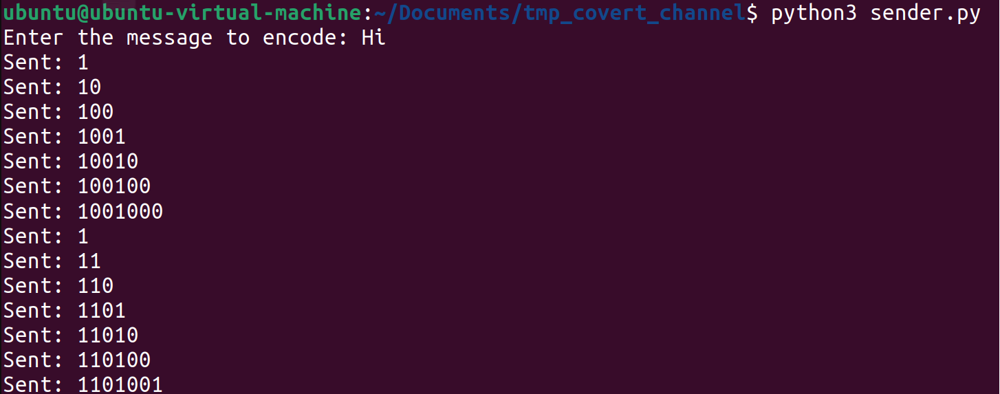
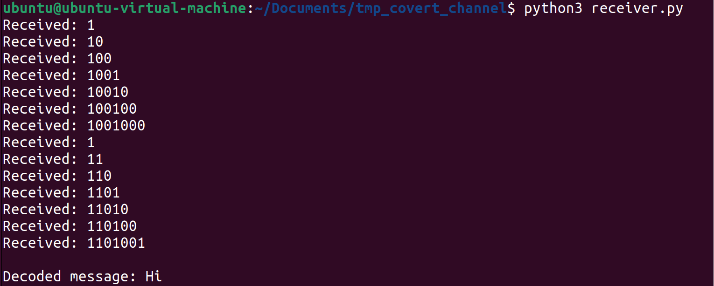

# Tmp Covert Channel



## Description
A simple covert channel that reads and writes to files within the Linux /tmp directory to transmit a hidden message. An empty, hidden file denotes a 0 whereas any other file size indicates a 1 in a binary data string.

## Getting Started

### Dependencies
* Python3

### Installing
```
# Clone this repository
$ git clone https://github.com/sea7321/tmp-covert-channel.git

# Go into the repository
$ cd tmp-covert-channel
```

### Executing program
To use sender.py and receiver.py, follow the below commands to send an encoded message and decode a message. When encoding, you will be prompted to type in your hidden message.

```
Send an encoded message
$ python3 sender.py

Receive a decoded a message
$ python3 receiver.py
```

## Author
Savannah Alfaro, sea2985@rit.edu